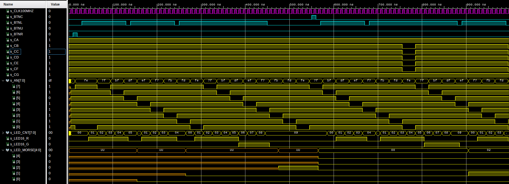
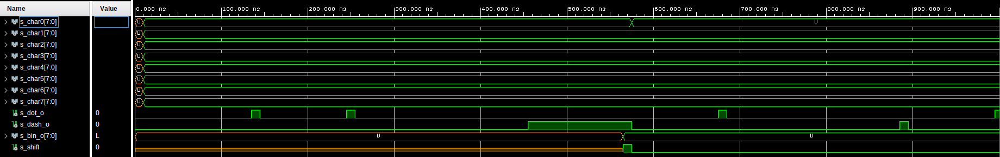
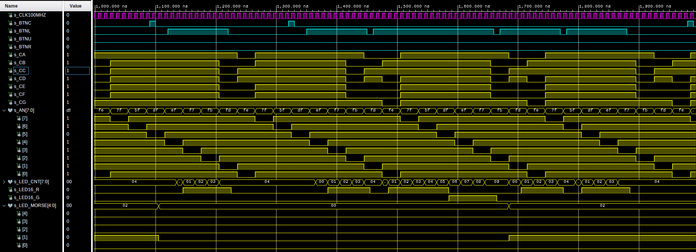
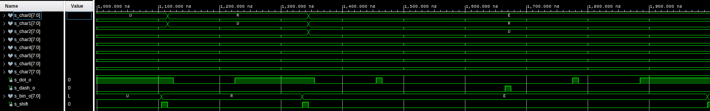
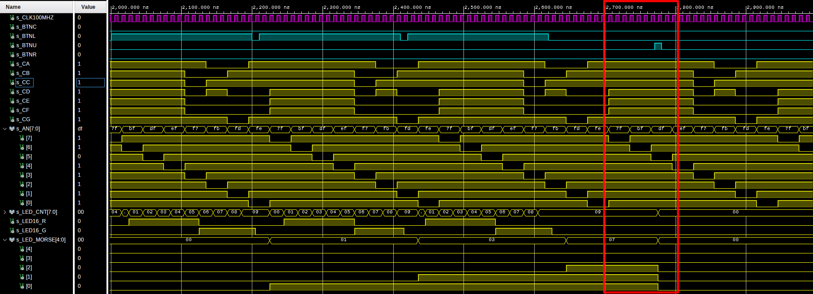
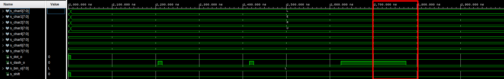
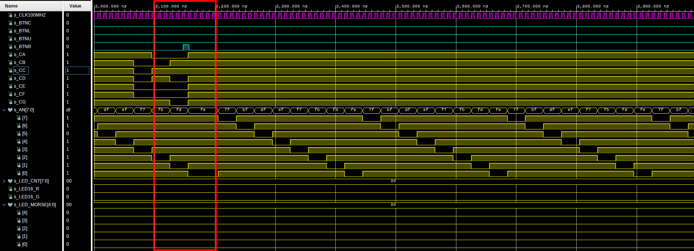
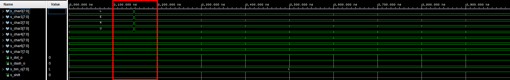
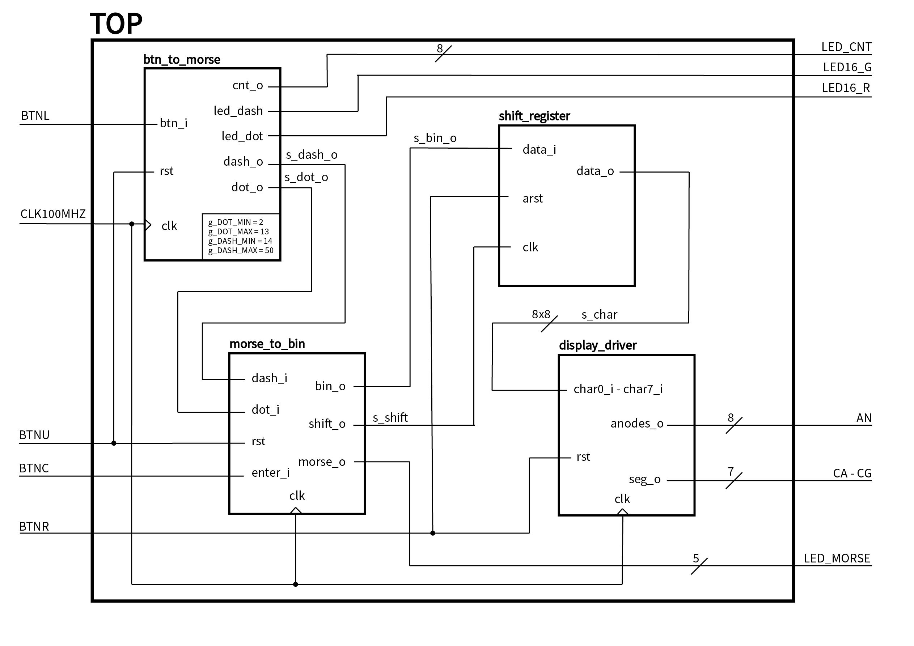

# Morse code receiver

### Členové týmu

* Filip Stryk (zodpovědný za edge_detector, shift_register a btn_to_morse (přepsaný na FSM), dokumentace)
* Petra Slotová (zodpovědná za moduly bin_7seg a display_driver, zpracování schémat, dokumentace)
* Natália Pločeková (zodpovědná za moduly morse_to_bin, btn_to_morse, dokumentace)
* David Pěčonka (zodpovědný za top modul a video)

### Obsah

* [Projekt](#objectives)
* [Popis HW](#hardware)
* [Popis a simulace VHDL modulů](#modules)
* [Popis a simulace TOP modulu](#top)
* [Video](#video)
* [Zdroje](#references)

## Projekt

Cílem projektu bylo zpracování zadané posloupnosti symbolů (Morseovy abecedy), převod a zobrazení znaku na 7segmentovém displeji. Projekt využíva koncepce running text, t.j. nově zadaný znak se zobrazí na úplně pravém displeji a všechny předchozí zadané znaky se posunou o 1 displej doleva. Znak, který byl při zadávaní nového znaku na úplně levém displeji, zmizí.

## Popis HW

4 tlačítka [13]: 
-  `BTNL` využívame k zadávaní symbolů (tečky, čárky), které rozlišujeme podle délky jeho stisknutí 
-  `BTNC` využívame k ukončení zadávaní symbolů a převedení posloupnosti na znak, který se pak zobrazí na displeji  
-  `BTNU` využívame ke zresetování zadávaného symbolu
-  `BTNR` využívame ke zresetování displeje

1 RGB LED [17]:
- délka stisku `BTNL` ovlivňuje barvu svícení, na základě které si kontrolujeme zadaný symbol. Při podržení tlačítka v intervalu od 50 ms do 325 ms svítí červená, pak od 350 ms do 2.5 sekundy svítí zelená)

13 LED [19]:
- LED(0-7) - znázorňuje a kontroluje hodnotu čítače během stisknutí `BTNL`
- LED(11-15) - znázorňuje zadaný symbol (nesvití - tečka, svití - čárka) 

7segmentový displej [21]:
- zobrazuje zadané znaky, při stisknutí `BTNR`, t.j. zadaní nového znaku se předcházející posune o jeden doleva

### Schéma zapojení

Použité LED jsou přes rezistor zapojeny trvale k zemi a spínají se tedy vysokou logickou úrovní. Segmenty jednotlivých displejů jsou v uspořádání se společnou anodou, tzn. spínají se katody => svítí při nízké logické úrovni. Anody jednotlivých displejů jsou spínány pomocí PNP tranzistorů, takže jsou taktéž sepnuty pouze pokud je na výstupu nula. Anody RGB LED jsou trvale přes rezistor připojeny k napájecímu napětí a jejich katody jsou spínány pomocí NPN tranzistorů. K použitým tlačítkům jsou připojeny pull-down rezistory, tudíž stisknutí tlačítka značí vysoká logická úroveň.

## Popis a simulace VHDL modulů

### btn_to_morse ([kód](morse-code-receiver/morse-code-receiver.srcs/sources_1/new/btn_to_morse.vhd))

Modul `btn_to_morse` slouží k zadání tečky nebo čárky pomocí jediného vstupního signálu `btn_i`. Tečka a čárka jsou rozlišeny podle doby, po kterou je signál ve vysoké úrovni. Časové intervaly pro tečku/čárku je možné nastavit pomocí hodnot `g_DOT_MIN`, `g_DOT_MAX`, `g_DASH_MIN`, `g_DASH_MAX`, kde každá hodnota značí počet cyklů interního hodinového signálu s frekvencí 25 ms, který je odvozen ze základního 100MHz hodinového signálu pomocí entity `clock_enable` s hodnotou `g_MAX` nastavenou na 2 500 000 period.

Kromě již zmíněného vstupu `btn_i` obsahuje entita dále vstupy `clk` a `rst` pro hodinový signál a reset. Výstupy pak jsou `dot_o` a `dash_o`, které slouží jako hlavní výstup, a `led_dot_o` a `led_dash_o`, které slouží k indikaci toho, jaký symbol by byl zadán, kdyby v danou chvíli přešel vstupní signál do logické nuly. Posledním výstupem je `cnt_o` s aktuální hodnotou interního čítače.

Entita funguje jako stavový automat se 4 stavy - `INIT`, `PUSHED`, `DOT` a `DASH`. Výchozím stavem je `INIT`, ve kterém jsou oba výstupy `dot_o` a `dash_o` nulové, stejně jako hodnota interního čítače `s_cnt`. Ze stavu `INIT` je možný přechod pouze do stavu `PUSHED`, a to pokud má `btn_i` hodnotu logické jedničky. V tomto stavu dochází k pravidelné inkrementaci čítače `s_cnt`, který tak měří dobu trvání vysoké úrovně. Ze stavu `PUSHED` je při změně `btn_i` na 0 možný přechod jak zpět do stavu `INIT`, tak i do stavů `DOT` a `DASH`. Rozhodujícím faktorem je hodnota `s_cnt`. Pokud se nachází v jednom z intervalů pro tečku/čárku, tak automat přejde do stavu `DOT`, resp. `DASH`. V případě, kdy je hodnota mimo oba intervaly, přejde automat zpět do výchozího stavu. Ve stavech `DOT` a `DASH` je pak aktivní odpovídající výstup `dot_o`, resp. `dash_o`. Z těchto dvou stavů je možný přechod pouze do výchozí stavu při vysoké úrovni `btn_i`.

#### Diagram stavového automatu

#### Průběhy signálů při simulaci

#### Průběhy signálů při simulaci (detail resetu)

### edge_detector ([kód](morse-code-receiver/morse-code-receiver.srcs/sources_1/new/edge_detector.vhd))

Tato entita slouží k detekci náběžné a sestupné hrany signálu jako náhrada za funkce `rising_edge` a `falling_edge`, které by se měly používat pouze pro hodinové signály.

Vstupem entity je hodinový signál `clk` a signál, na kterém se detekují hrany `sig_i`. Výtupy pak jsou `rise_o` a `fall_o`, které jsou aktivní při detekování náběžné, resp. sestupné hrany. Při každé náběžné hraně hodinového signálu je do interních signálů uložena aktuální a předcházející hodnota `sig_i`. Jednoduchými logickými [výrazy](morse-code-receiver/morse-code-receiver.srcs/sources_1/new/edge_detector.vhd#L32-L33) je pak detekována změna z nízké na vysokou úroveň a naopak.

#### Průběhy signálů při simulaci

### morse_to_bin ([kód](morse-code-receiver/morse-code-receiver.srcs/sources_1/new/morse_to_bin.vhd))

Entita `morse_to_bin` tvoří jádro celého projektu. Jejím úkolem je převést vstupní sekvenci teček a čárek, která reprezentuje znaky v Morseově abecedě, na [ASCII](https://en.wikipedia.org/wiki/ASCII) kód.

Vystupy entity jsou opět `clk` a `rst` pro hodinový signál a reset, `dot_i` a `dash_i` pro zadání tečky, resp. čárky, a `enter_i`, který slouží pro potvrzení zadané sekvence. Výstupem pak je osmibitový vektor `bin_o` s ASCII kódem zadaného znaku, pětibitový (maximální počet symbolů pro jeden znak v Morseově abecedě je 5) vektor `morse_o` s aktuální zadanou sekvencí, ve které je tečka reprezentována nulou a čárka jedničkou. Posledním výstupem je `shift_o`, který slouží k indikaci přeložení nového znaku pro následující blok - posuvný registr.

Hlavní část entity tvoří synchronní proces `p_morse_to_bin` spouštěný při náběžné hraně hodinového signálu. Pokud je aktivní vstup `rst`, tak dojde k vynulování zadané sekvence (`s_morse_local`) a její délky (`s_len`). V [opačném případě](morse-code-receiver/morse-code-receiver.srcs/sources_1/new/morse_to_bin.vhd#L65-L180) dojde při náběžné hraně vstupu `s_dot`/`s_dash` k přidání dalšího symbolu do sekvence a k inkrementaci signálu s její aktuální délkou. K detekci náběžných hran je použit [detektor hran](#edge_detector). Při náběžné  hraně vstupu `s_enter` je přeložena sekvence uložená v `s_morse_local` na ASCII kód odpovídající danému znaku z množiny `A-Z` a `0-9`. Zárověň je také vyslán jeden impulz (pouze při zadání platného znaku) na výstupu `s_shift` a jsou vynulovány signály `s_morse_local` a `s_cnt`.

#### ASCII tabulka

#### Morseova abaceda

#### Průběhy signálů při simulaci (A-I)

#### Průběhy signálů při simulaci (I-R)

#### Průběhy signálů při simulaci (R-Z)

#### Průběhy signálů při simulaci (Z-6)

#### Průběhy signálů při simulaci (3-9)

#### Průběhy signálů při simulaci (reset)

#### Průběhy signálů při simulaci (zadání neplatného znaku - není vyslán impulz na výstupu `shift_o`)

### shift_register ([kód](morse-code-receiver/morse-code-receiver.srcs/sources_1/new/shift_register.vhd))

Posuvný registr slouží k postupnému ukládání přeložených znaků před jejich zobrazením.

Vstup tvoří jeden osmibitový vektor `data_i`, asynchronní reset `arst` a hodinový vstup `clk`. Jediným výstupem je `data_o`, což je pole osmibitových vektorů. Datový typ `t_byte_array` pro tento výstup je definován v [balíčku](morse-code-receiver/morse-code-receiver.srcs/sources_1/new/data_types_pkg.vhd) `data_types_pkg`. Šířka posuvného registru je nastavitelná pomocí hodnoty `g_SR_WIDTH` s výchozí hodnotou 8.

Registr je tvořen jediným procesem `p_shift_register` reagujícím na signály `clk` a `arst`. Při aktivní úrovni asynchronního resetu je celý registr okamžitě vynulován. V interním signálu `s_length` je uložen aktuální počet hodnot na výstupu registru. Při sestupné hraně hodinového signálu jsou hodnoty na výstupu posunuty o jednu pozici s tím, že hodnota na konci výstupu je odstraněna a na nultou pozici je umístěna hodnota ze vstupu `data_i`.

#### Průběhy signálů při simulaci

### bin_7seg ([kód](morse-code-receiver/morse-code-receiver.srcs/sources_1/new/bin_7seg.vhd))

Úkolem této entity je převod ASCII kódu pro `A-Z` a `0-9` na rozsvícené segmenty sedmisegmentového displeje.

Vstupem entity je osmibitový vektor `s_bin` s ASCI kódem a výstupem sedmibitový vektor `seg_o`, kde každý bit reprezentuje jeden segment displeje (A-G). Jednička značí, že daný segment nesvítí. V nule ja pak segment rozsvícen, protože na použité vývojové desce jsou umístěny displeje se společnou anodou pro všechny segmenty.

Celou entitu tvoří jediný kombinační proces `p_7seg_decoder`, ve kterém je pomocí struktury `case`-`when` ASCII kód převeden na rozsvícené segmenty. V případě, že je na vstupu jiná hodnota, než pro definované znaky, tak jsou všechny segmenty zhasnuty.

#### Zobrazení písmen a číslic na displeji

#### Průběhy signálů při simulaci

### display_driver ([kód](morse-code-receiver/morse-code-receiver.srcs/sources_1/new/display_driver.vhd))

O zobrazení zadaných znaků na osmi sedmisegmentových displejích se stará tato entita.

Jejími vstupy je, kromě typických `clk` a `rst`, také 8 osmibitových vstupů `char0_i` až `char7_i` s ASCII kódy znaků pro jednotlivé displeje. Výstupy má entita dva - sedmibitový vektor `seg_o` reprezentující segmenty displeje a osmibitový vektor `anodes_o`, který představuje společné anody displejů.

Jádrem entity je multiplexer, který je tvořen synchronním procesem `p_mux`. V něm je podle hodnoty interního čítače na interní signál `s_ascii` přivedena hodnota z jednoho ze vstupů a také je aktivována anoda pro odpovídající displej. Interní [3bitový](morse-code-receiver/morse-code-receiver.srcs/sources_1/new/display_driver.vhd#L42) (8 displejů => 8 hodnot => 3 bity) čítač je realizován entitou [cnt_up_down](morse-code-receiver/morse-code-receiver.srcs/sources_1/new/cnt_up_down.vhd) a k jeho inkrementaci dochází při náběžné hraně signálu `clk` a zároveň aktivní úrovni `s_en`. Na něm je přítomen hodinový signál s periodou [2 ms](morse-code-receiver/morse-code-receiver.srcs/sources_1/new/display_driver.vhd#L31), který je zajišteň entitou [clock_enable](morse-code-receiver/morse-code-receiver.srcs/sources_1/new/clock_enable.vhd). Hodnota periody 2 ms byla zvolena proto, aby jeden cyklus, ve kterém jsou postupně rozsvěceny všechny displeje, trval celkem 16 ms, což je maximání doba, při které lidské oko nepostřehne, že se displeje zhasínají. ASCII kód v signálu `s_ascii` je nakonec přeložen na rozsvícené segmenty pomocí entity [bin_7seg](#bin_7seg).

#### Schéma

## Popis a simulace TOP modulu ([kód](morse-code-receiver/morse-code-receiver.srcs/sources_1/new/top.vhd))

Top modul slouží k propojení jednotlivých dílčích modulů (`btn_to_morse`, `morse_to_bin`, `shift_register` a `display_driver`). Všechny entity jsou propojeny pomocí [interních signálů](morse-code-receiver/morse-code-receiver.srcs/sources_1/new/top.vhd#L28-L39).

Vstupů je 5  - hodinový signál `CLK100MHZ` a 4 tlačítka `BTNC`, `BTNL`, `BTNU`, `BTNR`. Výstupy tvoří 7 katod sedmisegmentových displejů `CA`-`CG`, osmibitový vektor společných anod `AN`, 13 LED v osmibitovém vektoru `LED_CNT` a pětibitovém `LED_MORSE` a RGB LED `LED16`, ze které je využita pouze zelená `LED16_G` a červená `LED16_R` barva. Přiřazení vstupů a výstupů skutečným hardwarovým prvkům je popsáno v souboru [nexys-a7-50t.xdc](morse-code-receiver/morse-code-receiver.srcs/constrs_1/new/nexys-a7-50t.xdc).

Jednotlivá stisknutí tlačítka `BTNL` jsou převedena na tečku/čárku modulem `btn_to_morse`. Sekvence teček/čárek je následně po potvrzení tlačítkem `BTNC` modulem `morse_to_bin` přeložena z Morseovy abecedy na ASCII kód daného znaku, který je přiveden na vstup posuvného registru a celý registr je jednou posunut. 8 výstupních hodnot registru je poté přivedeno na vstupy modulu `display_driver`, ve kterém jsou z ASCII kódu převedeny na rozsvícené segmenty a pak jsou na odpovídajících displejích zobrazeny.

Vstupy:
- `CLK100MHZ` - hodinový signál
- `BTNL` - zadání tečky/čárky
- `BTNC` - potvrzení zadaného znaku
- `BTNU` - resetování rozepsaného znaku
- `BTNR` - vymazání displeje

Výstupy:
- `CA`-`CG` - katody sedmisegmentových displejů
- `AN` - společné anody displejů
- `LED_CNT` - hodnota čítače čítajícího délku stisknutí tlačítka
- `LED_MORSE` - zadaná sekvence teček/čárek (rozsvícená LED - čárka)
- `LED16_R` - indikace zadání tečky
- `LED16_G` - indikace zadání tečky

V simulacích je zobrazen průběh signálů při napsání *UREL*, po kterém následuje zadání tří čárek, reset aktuálně rozepsaného písmene a poté reset všech zobrazených znaků.

#### Průběhy vstupních a výstupních signálů při simulaci (0 až 1000 ns)

#### Průběhy interních signálů při simulaci (0 až 1000 ns)

#### Průběhy vstupních a výstupních signálů při simulaci (1000 až 2000 ns)

#### Průběhy interních signálů při simulaci (1000 až 2000 ns)

#### Průběhy vstupních a výstupních signálů při simulaci (2000 až 3000 ns)

#### Průběhy interních signálů při simulaci (2000 až 3000 ns)

#### Průběhy vstupních a výstupních signálů při simulaci (3000 až 4000 ns)

#### Průběhy interních signálů při simulaci (3000 až 4000 ns)

#### Schéma

## Video

## Zdroje

1. [https://vhdlguide.readthedocs.io/en/latest/index.html](https://vhdlguide.readthedocs.io/en/latest/index.html)
2. [https://stackoverflow.com/questions/33945914/vhdl-is-it-possible-to-concurrently-shift-array-elements](https://stackoverflow.com/questions/33945914/vhdl-is-it-possible-to-concurrently-shift-array-elements)
3. [https://stackoverflow.com/questions/18291515/variable-number-of-in-ports-in-an-entity](https://stackoverflow.com/questions/18291515/variable-number-of-in-ports-in-an-entity)
4. [https://stackoverflow.com/questions/63291844/vhdl-unconstrained-arrays-and-size-instaniation](https://stackoverflow.com/questions/63291844/vhdl-unconstrained-arrays-and-size-instaniation)
5. [https://vhdlguide.com/2016/07/23/edge-detector/](https://vhdlguide.com/2016/07/23/edge-detector/)