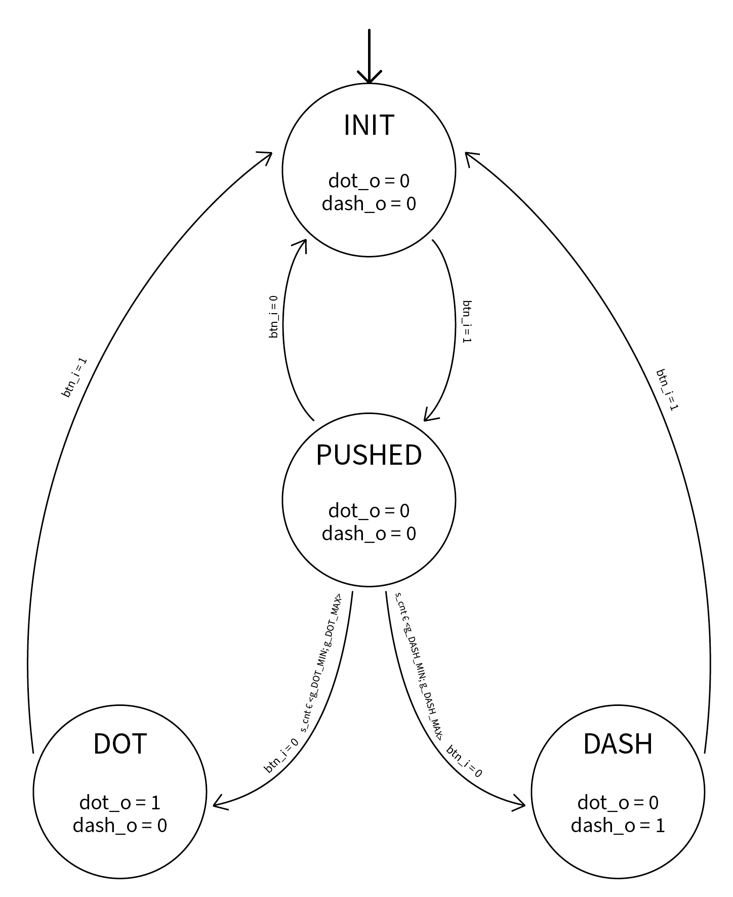
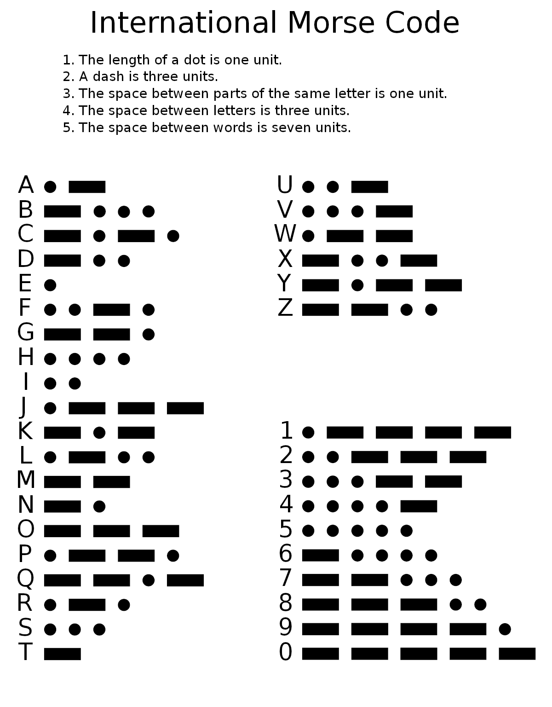
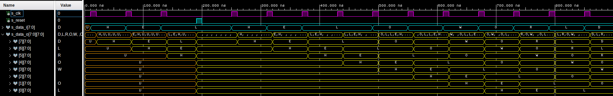
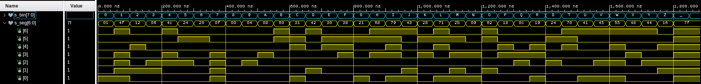

# Morse code receiver

### Členové týmu

* David Pěčonka (zodpovědný za top modul a video)
* Natália Pločeková (zodpovědná za moduly morse_to_bin, btn_to_morse, dokumentace)
* Petra Slotová (zodpovědná za moduly bin_7seg a display_driver, zpracování schém, dokumentace)
* Filip Stryk (zodpovědný za edge_detector, shift_register a btn_to_morse - přepsaný na FSM), dokumentace)

### Obsah

* [Projekt](#objectives)
* [Popis HW](#hardware)
* [Popis a simulace VHDL modulů](#modules)
* [Popis a simulace TOP modulu](#top)
* [Video](#video)
* [Zdroje](#references)

## Projekt

Write your text here.

## Popis HW

Write your text here.

## Popis a simulace VHDL modulů

### btn_to_morse ([kód](morse-code-receiver/morse-code-receiver.srcs/sources_1/new/btn_to_morse.vhd))

Modul `btn_to_morse` slouží k zadání tečky nebo čárky pomocí jediného vstupního signálu `btn_i`. Tečka a čárka jsou rozlišeny podle doby, po kterou je signál ve vysoké úrovni. Časové intervaly pro tečku/čárku je možné nastavit pomocí hodnot `g_DOT_MIN`, `g_DOT_MAX`, `g_DASH_MIN`, `g_DASH_MAX`, kde každá hodnota značí počet cyklů interního hodinového signálu s frekvencí 25 ms, který je odvozen ze základního 100MHz hodinového signálu pomocí entity `clock_enable` s hodnotou `g_MAX` nastavenou na 2 500 000 cyklů.

Kromě již zmíněného vstupu `btn_i` obsahuje entita dále vstupy `clk` a `rst` pro hodinový signál a reset. Výstupy pak jsou `dot_o` a `dash_o`, které slouží jako hlavní výstup, a `led_dot_o` a `led_dash_o`, které slouží k indikaci toho, jaký symbol by byl zadán, kdyby v danou chvíli přešel vstupní signál do logické nuly. Posledním výstupem je `cnt_o` s aktuální hodnotou interního čítače.

Entita funguje jako stavový automat se 4 stavy - `INIT`, `PUSHED`, `DOT` a `DASH`. Výchozím stavem je `INIT`, ve kterém jsou oba výstupy `dot_o` a `dash_o` nulové, stejně jako hodnota interního čítače `s_cnt`. Ze stavu `INIT` je možný přechod pouze do stavu `PUSHED`, a to pokud má `btn_i` hodnotu logické jedničky. V tomto stavu dochází k pravidelné inkrementaci čítače `s_cnt`, který tak měří dobu trvání vysoké úrovně. Ze stavu `PUSHED` je při změně `btn_i` na 0 možný přechod jak zpět do stavu `INIT`, tak i do stavů `DOT` a `DASH`. Rozhodujícím faktorem je hodnota `s_cnt`. Pokud se nachází v jednom z intervalů pro tečku/čárku, tak automat přejde do stavu `DOT`, resp. `DASH`. V případě, kdy je hodnota mimo oba intervaly, přejde automat zpět do výchozího stavu. Ve stavech `DOT` a `DASH` je pak aktivní odpovídající výstup `dot_o`, resp. `dash_o`. Z těchto dvou stavů je možný přechod pouze do výchozí stavu při vysoké úrovni `btn_i`.

#### Diagram stavového automatu

#### Průběhy signálů při simulaci

#### Průběhy signálů při simulaci (detail resetu)

### edge_detector ([kód](morse-code-receiver/morse-code-receiver.srcs/sources_1/new/edge_detector.vhd))

Tato entity slouží k detekci náběžné a sestupné hrany signálu jako náhrada za funkce `rising_edge` a `falling_edge`, které by se měly používat pouze pro hodinové signály.

Vstupem entity je hodinový signál `clk` a signál, na kterém se detekují hrany `sig_i`. Výtupy pak jsou `rise_o` a `fall_o`, které jsou aktivní při detekování náběžné, resp. sestupné hrany. Při každé náběžné hraně hodinového signálu je do interních signálů uložena aktuální a předcházející hodnota `sig_i`. Jednoduchými logickými [výrazy](morse-code-receiver/morse-code-receiver.srcs/sources_1/new/edge_detector.vhd#L32-L33) je pak detekována změna z nízké na vysokou úroveň a naopak.

#### Průběhy signálů při simulaci

### morse_to_bin ([kód](morse-code-receiver/morse-code-receiver.srcs/sources_1/new/morse_to_bin.vhd))

Entita `morse_to_bin` tvoří jádro celého projektu. Jejím úkolem je převést vstupní sekvenci teček a čárek, která reprezentuje znaky v Morseově abecedě, na [ASCII](https://en.wikipedia.org/wiki/ASCII) kód.

Vystupy entity jsou opět `clk` a `rst` pro hodinový signál a reset, `dot_i` a `dash_i` pro zadání tečky, resp. čárky, a `enter_i`, který slouží pro potvrzení zadávání znaku. Výstupem pak je osmibitový vektor `bin_o` s ASCII kódem zadaného znaku, pětibitový (maximální počet symbolů pro jeden znak v Morseově abecedě je 5) vektor `morse_o` s aktuální zadanou sekvencí, ve které je tečka reprezentována nulou a čárka jedničkou. Posledním výstupem je `shift_o`, který slouží k indikaci přeložení nového znaku pro následující blok - posuvný registr.

Hlavní část entity tvoří synchronní proces `p_morse_to_bin` spouštěný při náběžné hraně hodinového signálu. Pokud je aktivní vstup `rst`, tak dojde k vynulování zadané sekvence (`s_morse_local`) a její délky (`s_len`). V [opačném případě](morse-code-receiver/morse-code-receiver.srcs/sources_1/new/morse_to_bin.vhd#L65-L180) dojde při náběžné hraně vstupu `s_dot`/`s_dash` k přidání dalšího symbolu do sekvence a k inkrementaci signálu s její aktuální délkou. K detekci náběžných hran je použit [detektor hran](#edge_detector). Při náběžné  hraně vstupu `s_enter` je přeložena sekvence uložená v `s_morse_local` na ASCII kód odpovídající danému znaku z množiny `A-Z` a `0-9`. Zárověň je také vyslán jeden impulz (pouze při zadání platného znaku) na výstupu `s_shift` a jsou vynulovány signály `s_morse_local` a `s_cnt`.

#### ASCII tabulka

#### Morseova abaceda

#### Průběhy signálů při simulaci (A-I)

#### Průběhy signálů při simulaci (I-R)

#### Průběhy signálů při simulaci (R-Z)

#### Průběhy signálů při simulaci (Z-6)

#### Průběhy signálů při simulaci (3-9)

#### Průběhy signálů při simulaci (reset)

#### Průběhy signálů při simulaci (zadání neplatného znaku - není vyslán impulz na výstupu `shift_o`)

### shift_register ([kód](morse-code-receiver/morse-code-receiver.srcs/sources_1/new/shift_register.vhd))

Posuvný registr slouží k postupnému ukládání přeložených znaků před jejich zobrazením.

Vstup tvoří jeden osmibitový vektor `data_i`, asynchronní reset `arst` a hodinový vstup `clk`. Jediným výstupem je `data_o`, což je pole osmibitových vektorů. Datový typ `t_byte_array` pro tento výstup je definován v [balíčku](morse-code-receiver/morse-code-receiver.srcs/sources_1/new/data_types_pkg.vhd) `data_types_pkg`. Šířka posuvného registru je nastavitelná pomocí hodnoty `g_SR_WIDTH` s výchozí hodnotou 8.

Registr je tvořen jediným procesem `p_shift_registr` reagujícím na signály `clk` a `arst`. Při aktivní úrovni asynchronního resetu je celý registr okamžitě vynulován. V interním signálu `s_length` je uložen aktuální počet hodnot na výstupu registru. Při sestupné hraně hodinového signálu jsou hodnoty na výstupu posunuty o jednu pozici s tím, že hodnota na konci výstupu je odstraněna a na nultou pozici je umístěna hodnota ze vstupu `data_i`.

#### Průběhy signálů při simulaci

### bin_7seg ([kód](morse-code-receiver/morse-code-receiver.srcs/sources_1/new/bin_7seg.vhd))

Úkolem této entity je převod ASCII kódu pro `A-Z` a `0-9` na rozsvícené segmenty sedmisegmentového displeje.

Vstupem entity je osmibitový vektor `s_bin` s ASCI kódem a výstupem sedmibitový vektor `seg_o`, kde každý bit reprezentuje jeden segment displeje (A-G). Jednička značí, že daný segment nesvítí. V nule ja pak segment rozsvícen, protože na použité vývojové desce jsou umístěny displeje se společnou anodou pro všechny segmenty.

Celou entitu tvoří jediný kombinační proces `p_7seg_decoder`, ve kterém je pomocí struktury `case`-`when` ASCII kód převeden na rozsvícené segmenty. V případě, že je na vstupu jiná hodnota, než pro definované znaky, tak jsou všechny segmenty zhasnuty.

#### Zobrazení písmen a čísel na displeji

#### Průběhy signálů při simulaci

### display_driver ([kód](morse-code-receiver/morse-code-receiver.srcs/sources_1/new/display_driver.vhd))

O zobrazení zadaných znaků na osmi sedmisegmentových displejích se stará tato entita.

Jejími vstupy je, kromě typických `clk` a `rst`, také 8 osmibitových vstupů `char0_i` až `char7_i` s ASCII kódy znaků pro jednotlivé displeje. Výstupy má entita dva - sedmibitový vektor `seg_o` reprezentující segmenty displeje a osmibitový vektor `anodes_o`, který představuje společné anody displejů.

Jádrem entity je multiplexer, který je tvořen synchronním procesem `p_mux`. V něm je podle hodnoty interního čítače na interní signál `s_ascii` přivedena hodnota z jednoho ze vstupů a také je aktivována anoda pro odpovídající displej. Interní [3bitový](morse-code-receiver/morse-code-receiver.srcs/sources_1/new/display_driver.vhd#L42) (8 displejů => 8 hodnot => 3 bity) čítač je realizován entitou [cnt_up_down](morse-code-receiver/morse-code-receiver.srcs/sources_1/new/cnt_up_down.vhd) a k jeho inkrementaci dochází při náběžné hraně signálu `s_en`. Na něm je přítomen hodinový signál s periodou [2 ms](morse-code-receiver/morse-code-receiver.srcs/sources_1/new/display_driver.vhd#L31), který je zajišteň entitou [clock_enable](morse-code-receiver/morse-code-receiver.srcs/sources_1/new/clock_enable.vhd). Hodnota periody 2 ms byla zvolena proto, aby jeden cyklus, ve kterém jsou postupně rpzsvěceny všechny displeje, trval celkem 16 ms, což je maximání doba, při které lidské oko nepostřehne, že se displeje zhasínají. ASCII kód v signálu `s_ascii` je nakonec přeložen na rozsvícené segmenty pomocí entity [bin_7seg](#bin_7seg).

#### Schéma

## Popis a simulace TOP modulu

Write your text here.

## Video

Write your text here

## Zdroje

1. Write your text here.
